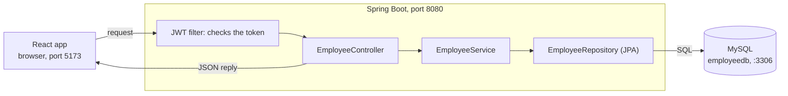
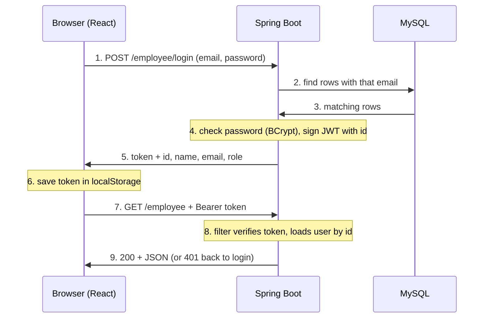

# AIML Employee App — Project Guide

A React front end talks to a Spring Boot back end over HTTP/JSON, and the back end stores employees in MySQL. Read top to bottom to learn what each folder does and what happens on every click.

## The big picture

Three programs run at the same time, and each one only talks to its neighbour.

| Part | Folder | Runs on | Job |
| --- | --- | --- | --- |
| Front end (React + Vite) | `my-react-app/` | http://localhost:5173 | Shows the pages and sends HTTP requests with axios |
| Back end (Spring Boot, Java 21) | `src/`, `pom.xml`, `mvnw` | http://localhost:8080 | Checks the login token, applies the rules, reads and writes the database |
| Database (MySQL 8) | Installed on Windows as service MYSQL80 | localhost:3306 | Stores the `employee` table in database `employeedb` |



Every click follows the same path: the React page calls the API, the JWT filter checks who you are, the controller hands the request to the service, and the repository turns it into SQL. The answer comes back as JSON and React redraws the page with it.

## Backend folders

All Java code lives in `src/main/java/com/anurag/aiml/`, split into one package per layer. Each layer only calls the one below it, so every file has a single job.

| Folder (package) | File | What it does |
| --- | --- | --- |
| project root | `pom.xml` | Lists the libraries Maven downloads: Spring Web, Spring Data JPA, Spring Security, validation, the MySQL driver and jjwt (JWT tokens) |
| project root | `mvnw`, `mvnw.cmd`, `.mvn/` | Maven wrapper, so `./mvnw spring-boot:run` works without installing Maven |
| `src/main/resources` | `application.properties` | Settings: port 8080, MySQL URL, username and password, `ddl-auto=update` (Hibernate creates and updates the table from the entity), JWT secret and 24-hour expiry |
| `aiml` | `AimlApplication.java` | The `main` method. `@SpringBootApplication` scans every package below it and wires the beans together |
| `config` | `SecurityConfig.java` | Decides which URLs are public (login, register) and which need a token; plugs in the JWT filter; provides the BCrypt `PasswordEncoder` |
| `config` | `CorsConfig.java` | Allows the browser on ports 5173 and 5174 to call port 8080. Without it, the browser blocks every request |
| `filter` | `JWTAuthentication.java` | Runs before every request. Reads `Authorization: Bearer <token>`, validates it and marks the user as logged in |
| `controller` | `EmployeeController.java` | Maps URLs to Java methods (`GET /employee`, `POST /employee/login` and so on). Converts JSON to objects and back; holds no business logic |
| `service` | `EmployeeService.java` | The business rules: hash passwords, block duplicate emails, check the password at login, keep the old password when an update sends a blank one |
| `service` | `JWTService.java` | Creates a signed token that holds the employee id, and later checks its signature and expiry |
| `repository` | `EmployeeRepository.java` | An interface extending `JpaRepository`. Spring generates the SQL from method names such as `findByEmail` and `existsByEmailAndIdNot` |
| `entity` | `Employee.java` | The Java class mapped to the `employee` table: `id`, `name`, `role`, `email`, `password`. The password is write-only, so it never appears in JSON responses |
| `dto` | `EmployeeDto.java` | The shape of create and update requests, with validation rules (email format, password of 8 or more characters, required on create) |
| `dto` | `LoginResponseDto.java` | What login returns: `token`, `id`, `name`, `email`, `role`, `message` |
| `exception` | `GlobalExceptionHandler.java` | Turns errors into clean JSON: validation errors return 400, `ResourceNotFoundException` 404, `ConflictException` 409 |
| `exception` | `ResourceNotFoundException.java`, `ConflictException.java` | Custom errors the service throws for "no such id" and "email already used" |
| `src/test` | `AimlApplicationTests.java` | A starter test that checks the application context loads |

`target/` is Maven's build output and can be deleted at any time; it is recreated on the next build.

## Frontend folders

The React app lives in `my-react-app/`. Only `src/` holds code you write; the rest is tooling and build output.

| Path | What it does |
| --- | --- |
| `package.json` | Lists the libraries (React 19, react-router-dom, axios, Vite) and the scripts `npm run dev`, `npm run build` and `npm run lint` |
| `vite.config.js` | Vite settings. Vite serves the app on port 5173 and reloads the page when you save a file |
| `index.html` | The single HTML page. React draws everything inside its `<div id="root">` |
| `node_modules/` | Downloaded libraries, created by `npm install`. Never edit; safe to delete and reinstall |
| `dist/` | Production build from `npm run build`. Not used while developing |
| `src/main.jsx` | Starting point: mounts `<App />` into `#root` |
| `src/App.jsx` | The router. Maps URLs to pages and wraps `/dashboard`, `/home` and `/employee` in `RequireAuth`, which sends you to `/login` when there is no token |
| `src/api.js` | One shared axios client pointed at http://localhost:8080. It adds the token to every request, sends you to login on a 401, and `errorMessage()` turns backend errors into readable text |
| `src/login.jsx` | Login form. On success it saves `token` and `user` in `localStorage` and opens the dashboard |
| `src/register.jsx` | Sign-up form. Checks the password length, then calls `POST /employee` |
| `src/dashboard.jsx` | Home page after login. Faculty see every record and can add, edit and delete; students see their profile and the faculty list |
| `src/Employee.jsx` | A separate management page (`/employee`) with the same add, edit and delete table; faculty reach it from "Manage Employees" |
| `src/index.css`, `src/App.css`, `src/assets/` | Styles and images |

`localStorage` is the browser's small key-value store. The app keeps two keys there: `token` (the JWT) and `user` (your id, name, email and role).

## Backend workflow

Every request takes the same path through the layers. Here is one real request followed from start to finish: a faculty member renames employee 7.

```http
PUT http://localhost:8080/employee/7
Authorization: Bearer eyJhbGciOi...
Content-Type: application/json

{"name":"Asha K","role":"Faculty","email":"asha@x.com","password":""}
```

1. **CORS check** (`CorsConfig`). The browser first sends an `OPTIONS` "preflight" request asking whether port 5173 may call port 8080. Spring answers yes, and the browser sends the real request.
2. **JWT filter** (`JWTAuthentication`). Reads the `Authorization` header and asks `JWTService` whether the signature is valid and the token has not expired. If so, it loads the caller (the employee whose id is inside the token) and marks them logged in for this request only; nothing is kept in a server session.
3. **Security rules** (`SecurityConfig`). `PUT /employee/7` is not public, so a logged-in user is required. No valid token means the request stops here with **401**.
4. **Controller** (`EmployeeController.updateEmployee`). Spring turns the JSON into an `EmployeeDto` and runs its validation rules. A bad email or a 3-character password stops here with **400** and a field-by-field message.
5. **Service** (`EmployeeService.updateEmployee`). Loads employee 7 (**404** if missing), refuses an email another account already uses (**409**), copies the new name, role and email, and keeps the old password because this one is blank.
6. **Repository and database** (`EmployeeRepository.save`). Hibernate writes `UPDATE employee SET ... WHERE id = 7` to MySQL.
7. **Response.** The saved `Employee` goes back up the chain and Jackson turns it into JSON, leaving out the password:

```json
{"id":7,"name":"Asha K","role":"Faculty","email":"asha@x.com"}
```

Errors never leak Java stack traces: any exception thrown in steps 4–6 is caught by `GlobalExceptionHandler` and returned as JSON with the right status code.

## Login and JWT

You log in once and get a token, a signed pass valid for 24 hours; the browser shows that token on every later request instead of your password.



Steps 1–5 happen once, at login. Steps 7–9 repeat for every page load, edit and delete.

**What is inside the token.** A JWT has three dot-separated parts: a header, a payload and a signature. Here the payload holds `sub` (the employee id), `iat` (issued at) and `exp` (expires at). The server signs it with `jwt.secret`, so anyone can read the payload but nobody can change it without breaking the signature.

**How login checks the password** (`EmployeeService.login`):

- Looks up every row with that email, newest first, because older data has duplicate emails.
- Compares the typed password with BCrypt for hashed rows, and as plain text for rows saved before hashing existed.
- On a plain-text match, it re-saves that row with a BCrypt hash, so old accounts upgrade themselves.
- A wrong email or password always gives the same **401 Invalid email or password**, so nobody can probe which emails exist.

**Why the id and not the email.** The same email appears on several old rows. The id is unique, so the filter always loads the right person.

**Logging out** just deletes `token` and `user` from `localStorage`. The server keeps no session, so there is nothing to clear on its side; a copied token keeps working until it expires.

## Frontend workflow

Each page follows the same React loop: **form input → state → API call → new state → the page redraws**.

- `useState` holds what the page shows (the form fields, the list of users).
- `onChange` copies every keystroke into state, so the inputs and the state never disagree.
- `onSubmit` calls `event.preventDefault()` (stops the browser reloading the page), then calls the API through `api.js`.
- When the answer arrives, the page stores it with `setUsers(...)` or `setFormData(...)`, and React redraws only what changed.
- `useEffect(..., [])` runs once when a page opens; the dashboard uses it to load the list.
- Every `catch` shows `errorMessage(err)`, so you see the backend's own words, such as "An account with this email already exists".

| User action | Page (file) | API call | On success | On error |
| --- | --- | --- | --- | --- |
| Register | `/register` (`register.jsx`) | `POST /employee` | Alert, then back to login | 400 field messages, 409 email already used |
| Log in | `/` or `/login` (`login.jsx`) | `POST /employee/login` | Saves `token` + `user`, opens `/dashboard` | 401 Invalid email or password |
| Open dashboard | `/dashboard` (`dashboard.jsx`) | `GET /employee` | Faculty: full table. Student: profile + faculty list | 401: token cleared, back to login |
| Add a member (faculty) | `/dashboard` or `/employee` | `POST /employee` | Alert, form clears, list reloads | 400 or 409 message |
| Edit (faculty) | `/dashboard` or `/employee` | `PUT /employee/{id}` | Alert, list reloads; editing yourself also updates the header | 400, 404 or 409 message |
| Delete (faculty) | `/dashboard` or `/employee` | `DELETE /employee/{id}` | Alert, list reloads; deleting yourself logs you out | 404 message |
| Refresh Data | `/dashboard` | `GET /employee` | Table redraws with the latest rows | Error alert |
| Manage Employees link | `/dashboard` → `/employee` | None until the page loads | Opens the management page | None |
| Logout | `/dashboard` | None | Deletes `token` + `user`, back to login | None |
| Visit a protected URL without logging in | any | None | `RequireAuth` redirects to `/login` | None |

The Edit form leaves the password empty on purpose. Leave it blank to keep the current password, or type 8 or more characters to change it.

**Roles are checked only in the front end.** "Faculty" and "Student" decide which buttons the dashboard shows. The backend requires a token for edit and delete, but it does not check the role yet, so a student with a token could still call those URLs directly.

## Endpoint reference

Base URL: http://localhost:8080. Send JSON with `Content-Type: application/json`; protected endpoints also need `Authorization: Bearer <token>`.

| Method | URL | Token | Request body | Success | Errors |
| --- | --- | --- | --- | --- | --- |
| POST | `/employee/login` | No | `{email, password}` | 200 `{token, id, name, email, role, message}` | 400 missing fields, 401 wrong email or password |
| POST | `/employee` | No | `{name, role, email, password}`, password 8+ characters | 201 the new employee | 400 validation, 409 email exists |
| GET | `/employee` | Yes | None | 200 list of employees | 401 |
| GET | `/employee/{id}` | Yes | None | 200 one employee | 401, 404 |
| PUT | `/employee/{id}` | Yes | `{name, role, email, password}`; blank password keeps the old one | 200 the updated employee | 400, 401, 404, 409 |
| DELETE | `/employee/{id}` | Yes | None | 200 `{message}` | 401, 404 |

Try it from Git Bash with curl (the `-d` body sends a POST):

```bash
# 1. log in and copy the token from the reply
curl -H "Content-Type: application/json" -d '{"email":"you@x.com","password":"secret123"}' http://localhost:8080/employee/login

# 2. use it
curl -H "Authorization: Bearer PASTE_TOKEN_HERE" http://localhost:8080/employee
```

## Running it and common errors

Start the three parts in this order, each in its own terminal:

1. **MySQL.** It now starts with Windows. To check it, run `Get-Service MYSQL80` in PowerShell; if it says Stopped, run `Start-Service MYSQL80` as Administrator.
2. **Backend.** In the project folder, run `./mvnw spring-boot:run`. It is ready when the log says `Started AimlApplication`.
3. **Frontend.** Run `cd my-react-app`, then `npm install` (first time only), then `npm run dev`. Open http://localhost:5173.

| What you see | Cause | Fix |
| --- | --- | --- |
| Backend log: `Communications link failure` / `Connection refused` | MySQL is not running | Start the MYSQL80 service |
| Backend log: `Access denied for user 'root'` | Wrong MySQL password | Change `spring.datasource.password` in `application.properties` |
| Backend log: `Port 8080 was already in use` | An old backend is still running | Close it, or find it with `netstat -ano \| findstr :8080` and end that process |
| Alert: "Could not reach the backend…" | Backend not started or crashed | Start it and check its log |
| Browser console: `blocked by CORS policy` | Frontend runs on a port other than 5173 or 5174 | Add that port in `CorsConfig.java` |
| Sent back to the login page | Token missing, expired (24 hours) or signed with an old secret | Log in again |
| 409 "An account with this email already exists" | Email already registered | Log in instead, or use another email |
| 400 "Atleast password required 8 char" | Password shorter than 8 characters | Use a longer password |

**Before sharing or deploying:** set a real secret with the `JWT_SECRET` environment variable (32+ characters) and move the MySQL password out of `application.properties`.
